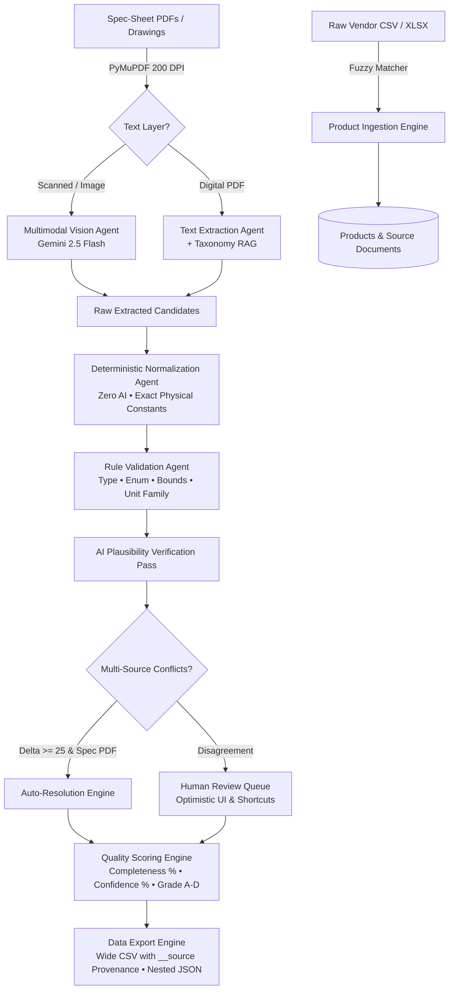

# SpecForge — Industrial Product Intelligence & Multimodal Spec Normalization Engine

> **Every attribute, with a verifiable receipt.**

SpecForge is an industrial-grade product data intelligence platform that ingests raw vendor catalogs (CSV/XLSX), engineering drawings, and spec-sheet PDFs, extracts structured technical specifications via multimodal AI (Gemini 2.5 Flash + PyMuPDF), deterministically normalizes units using exact physical constants, detects and auto-resolves multi-source data conflicts, assigns quality grades (A–D), and exports standardized product data with complete document provenance.

*Note: This platform was engineered by our team, reusing and adapting our battle-tested internal application foundation, UI token design system, and background job architecture.*

---

## Architecture Overview



---

## Key Features

1. **Multimodal Vision & Scanned Document Intelligence**:
   - Automatic scan detection via `pypdf`.
   - High-fidelity 200 DPI page rendering using **PyMuPDF (`pymupdf`)**.
   - Multimodal **Gemini 2.5 Flash** reading dimensional engineering drawings, callouts, and catalog tables (strictly isolating rows matching the target SKU).
   - SHA-256 caching ensures 0 redundant API calls on re-enrichment.

2. **Pure Deterministic Normalization (Zero AI)**:
   - 100% deterministic physical unit conversions (`INCH_TO_MM = 25.4`, `BAR_TO_PSI = 14.50377...`, `LB_TO_KG = 0.45359...`).
   - Standardizes length (`mm`), pressure (`psi`), temperature (`°C`), mass (`kg`), thread connections (`npt_female`, `flanged_150`, etc.), materials (`stainless_316`, `bronze`, `brass`), booleans, and enums.

3. **Validation & Multi-Source Conflict Detection**:
   - Rule-based constraint engine checking `missing_required`, `type_mismatch`, `enum_violation`, `out_of_range:min|max`, `unit_family_mismatch`, and `low_confidence`.
   - Soft AI plausibility pass to identify mechanically impossible parameter combinations.
   - Cross-document conflict detector: auto-resolves when a spec-sheet PDF outranks other sources by $\ge 25$ confidence points, or routes to human review.

4. **Banded Quality Scoring & Grades (A–D)**:
   - **Completeness Score**: Percentage of required schema attributes filled.
   - **Confidence Score**: Mean confidence across non-rejected attributes.
   - **Quality Grade**: Grade A ($\ge 90\%$ completeness, $\ge 85\%$ confidence), B ($\ge 75\%, \ge 70\%$), C ($\ge 50\%, \ge 50\%$), D ($< 50\%$).

5. **Curator Review Queue & Provenance Drawer**:
   - Human-in-the-loop review queue sorted by confidence ascending (worst first).
   - Optimistic approvals with automatic rollback on error.
   - Keyboard shortcuts: `A` (Approve), `R` (Reject), `E` (Inline Edit), `J`/`K` (Navigate).
   - Right-side Provenance Drawer providing instant inspection of filename, verified page number, content hash, and verbatim evidence text.

6. **AI Schema Generator**:
   - Proposes standard engineering taxonomy schemas for any industrial equipment category (e.g. Ball Valves, Centrifugal Pumps, Fasteners).
   - Live JSON Import / Export editor.

7. **Wide CSV & Nested JSON Export**:
   - Wide CSV format with companion provenance columns: `<key>__source` holding `"filename p.N"`.
   - Nested JSON carrying full attribute metadata and source document receipts.

8. **Security & Diagnostics**:
   - API Key Guard: When `API_KEY` is configured, mutating endpoints require the `X-API-Key` header while read-only browsing remains accessible for evaluators.
   - `/health/deep` endpoint validating database connectivity, vector extensions, and Gemini model availability.

---

## Environment Variables

### Backend (`backend/.env`)
```bash
APP_NAME=SpecForge
APP_ENV=development
PORT=8000
BACKEND_HOST=127.0.0.1
BACKEND_PORT=8000
FRONTEND_URL=http://localhost:5173
FRONTEND_URLS=http://localhost:5173,http://127.0.0.1:5173

# Database (SQLite by default, or PostgreSQL)
DATABASE_URL=sqlite:///./specforge.db

# Multimodal LLM & Vision
GEMINI_API_KEY=your_gemini_api_key_here
GEMINI_MODEL=gemini-2.5-flash
EMBEDDING_MODEL=gemini-embedding-001
VISION_ENABLED=True
VISION_MAX_PAGES=10
VISION_DPI=200

# Security (Optional mutating endpoint guard)
API_KEY=
```

### Frontend (`frontend/.env`)
```bash
VITE_API_BASE_URL=http://localhost:8000/api
```

---

## Quickstart & Local Development

### 1. Backend Setup
```bash
cd backend
python3 -m venv venv
source venv/bin/activate
pip install -r requirements.txt

# Run backend server (auto-runs database migrations at startup)
uvicorn app.main:app --host 127.0.0.1 --port 8000 --reload
```

### 2. Frontend Setup
```bash
cd frontend
npm install
npm run dev
```
Open [http://localhost:5173](http://localhost:5173) in your browser.

---

## Test Suite Execution

Run unit and deterministic normalization tests:
```bash
cd backend
venv/bin/pytest -v
```

Test production frontend build:
```bash
cd frontend
npm run build
```
